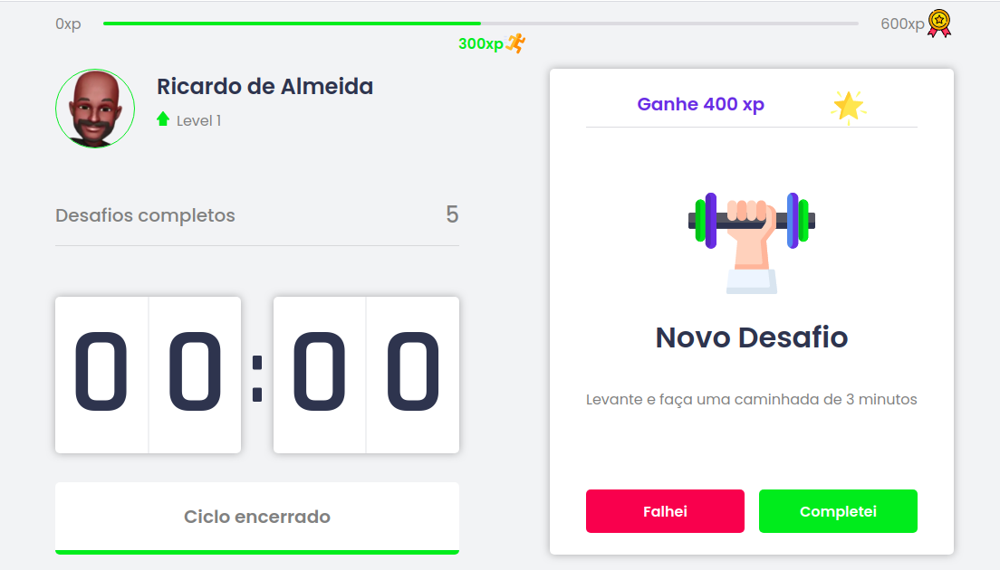
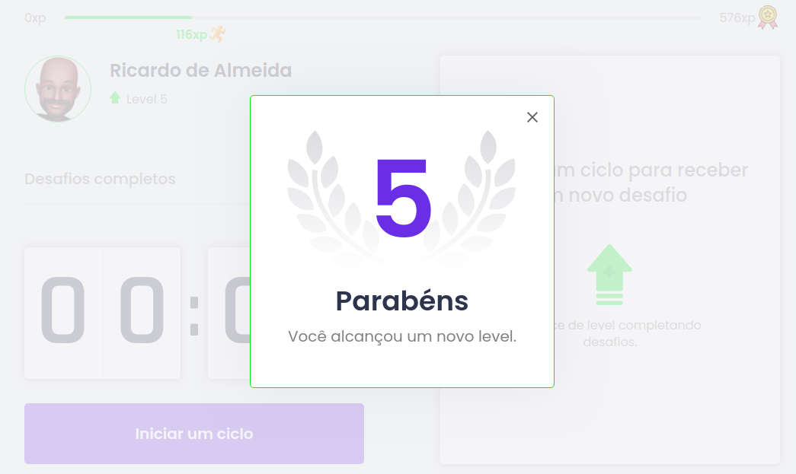
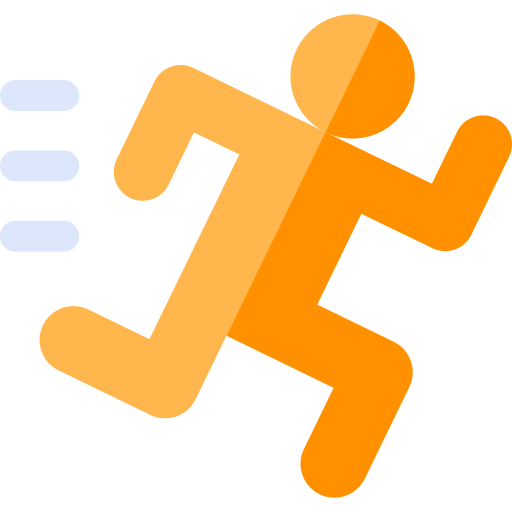

# NLW4 - Next Level Week 4 - Rocketseat - Move it!

## Demonstração:

## Techs - Tecnologias envolvidas:
* [ ] React
* [ ] Next
* [ ] Typescript
* [ ] HTML
* [ ] CSS

## Veja o projeto em funcionamento:
Deploy realizado na vercel.

https://moveit-prototype.vercel.app/

## Contribuições externas:
### 1) Rocketseat:
    Este protótipo só foi possível com a contribuição da Rocketseat, através da NLW4. Será bem útil para o meu portfólio.

    Para conhecer o excelente trabalho da Rocketseat, seguem links:
    * Site Oficial - https://rocketseat.com.br/
    * Youtube - Rocketseat: https://www.youtube.com/c/RocketSeat/featured
    
    Não  perca tempo e acesse e dê um passo para o pŕoximo nível:

## 2) Imagens:
    Algumas imagens foram obtidas de:

### Flaticon: 
#### Medalha: 

Icons made by <a href="https://www.freepik.com" title="Freepik">Freepik</a> from <a href="https://www.flaticon.com/" title="Flaticon">www.flaticon.com</a>

#### Correndo:

Icons made by <a href="https://www.freepik.com" title="Freepik">Freepik</a> from <a href="https://www.flaticon.com/" title="Flaticon">www.flaticon.com</a>

#### Estrela:

Icons made by <a href="https://www.freepik.com" title="Freepik">Freepik</a> from <a href="https://www.flaticon.com/" title="Flaticon">www.flaticon.com</a>

## 3) Author:
**Ricardo de Almeida**, tutoriado pelo **Diego Fernandes, da Rocketseat**.